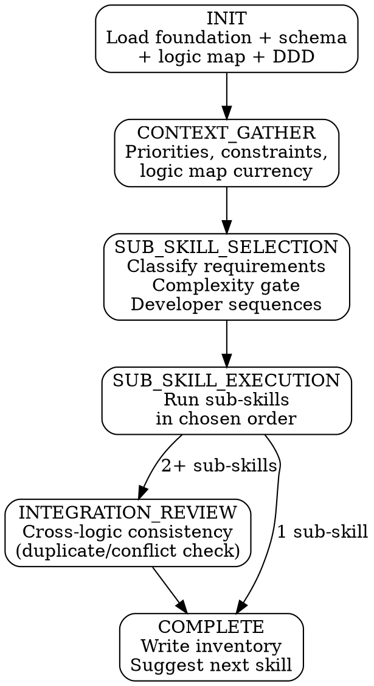

# Business Logic

business-logic is a **router skill** that gathers context, classifies logic requirements from the logic map, applies complexity gates, and dispatches to sub-skills in developer-chosen sequence. Each sub-skill is fully self-contained.

**Announce:** "I'm using the business-logic skill to [create/resume/add to] your business logic implementation."

## Plan Mode Exit

<HARD-GATE>
This skill and its sub-skills write files at SCAFFOLD, IMPLEMENT, TEST, and COMPLETE stages. If plan mode is active, tell the developer:
"business-logic needs to write files as we go. Please exit plan mode (Shift+Tab) so I can proceed."
Do NOT continue past Mode Selection while plan mode is active.
</HARD-GATE>

---

## Prerequisites

<HARD-GATE>
Before proceeding, verify all of the following exist in `.foundation/` and are NOT placeholders:
- `00-project-identity.md`
- `01-requirements.md`
- `02-architecture-decisions.md`

And verify the physical model exists:
- `docs/schema-physical-model.md`

If foundation files are missing → STOP:
"I need a project foundation before I can implement business logic. Run solution-discovery first."

If the physical model is missing → STOP:
"I need the physical data model for entity relationships and column types. Run schema-design first."

Also verify `.foundation/.discovery-state.json` shows `"stage": "COMPLETE"`.
</HARD-GATE>

---

## Optional Input Detection

```
IF .foundation/06-logic-map.md exists AND is NOT placeholder:
  → Load for logic type classification
  → Announce: "Logic map loaded — [N] requirements classified."

IF .foundation/06-logic-map.md is absent or placeholder:
  → Warn: "No logic map found. All logic type routing will require manual input.
    Consider populating your foundation's logic map section."

IF docs/ddd-model.md exists:
  → Extract domain events for trigger mapping
  → Announce: "DDD model loaded — domain events available for trigger mapping."

IF docs/ui-form-event-map.md exists:
  → Note client script requirements for client-script dispatch
  → Announce: "Form event map loaded — [N] client script events identified."

IF docs/ui-form-event-map.md is absent:
  → Note: "No form event map. Client script event discovery will happen during
    the sub-skill conversation."
```

---

## Mode Selection

```
IF .pp-context/skill-state.json does not exist
   OR does not contain business-logic entries → CREATE mode
IF skill-state.json shows activeSkill == "business-logic"
   AND activeStage != "COMPLETE" → RESUME mode
IF skill-state.json shows "business-logic" in completedSkills:
  → Check for existing artifacts
  → Offer re-entry: Continue / Add sub-skill / Revise
```

## Companion File Loading

<EXTREMELY-IMPORTANT>
Load companion files at the specified points. These are directives, not suggestions.

**CREATE mode:**
1. Read `./conversation-guide.md` now.

**RESUME mode:**
1. Read `.pp-context/skill-state.json` to determine resume point.
2. Read `./conversation-guide.md` to continue from the first incomplete stage.
3. If resuming inside a sub-skill, also read that sub-skill's SKILL.md.

**Re-entry:**
1. Read `./conversation-guide.md` now.
2. Read existing artifacts to present current state.
</EXTREMELY-IMPORTANT>

---

## Router State Machine



## Stage-Gate Summary

| Stage | Writes | Can skip? | Gate condition |
|---|---|---|---|
| INIT | — | No | Foundation and physical model exist, mode selected |
| CONTEXT_GATHER | — | No | Developer confirms context and logic map currency |
| SUB_SKILL_SELECTION | — | No | Requirements classified, complexity gate applied, developer selects and sequences |
| SUB_SKILL_EXECUTION | Sub-skill artifacts | No | Each sub-skill completes its own state machine |
| INTEGRATION_REVIEW | — | Yes — if only one sub-skill was run | Cross-logic consistency confirmed |
| COMPLETE | `docs/business-logic-inventory.md`, `.pp-context/skill-state.json` | No | All artifacts written, next skill suggested |

## Sub-skill Dispatch Protocol

<EXTREMELY-IMPORTANT>
Same protocol as ui-design router:
1. Take the first sub-skill from the queue
2. Read that sub-skill's SKILL.md from its directory
3. Follow the sub-skill's complete state machine
4. When sub-skill reaches COMPLETE, return to router
5. Present between-sub-skill prompt if more remain
6. Update state after each sub-skill completes
</EXTREMELY-IMPORTANT>

## Business Rule Complexity Gate

<EXTREMELY-IMPORTANT>
At SUB_SKILL_SELECTION, before the developer selects sub-skills, apply the complexity gate to any business rule candidates from the logic map:

**In scope for business-rule:**
- Show/hide fields based on field values
- Enable/disable (lock) fields based on conditions
- Set field values (simple expressions, no cross-record lookups)
- Set required level based on conditions
- Validate field values and show errors

**Redirect to csharp-plugin if:**
- Logic requires cross-entity data (lookup, aggregate calculation)
- Logic requires complex branching (more than 3 nested conditions)
- Logic must enforce server-side without form bypass
- Logic requires reading data not on the current record

**Redirect to client-script if:**
- Logic requires JavaScript-level form interaction beyond show/hide
- Logic requires reading form context (tab structure, section visibility)

Present redirections to the developer for confirmation before proceeding.
</EXTREMELY-IMPORTANT>

## Available Sub-skills

| Sub-skill | Logic type | Directory |
|---|---|---|
| csharp-plugin | Server-side C# logic on Dataverse messages | `./csharp-plugin/` |
| power-automate | Automated workflows triggered by Dataverse events or schedules | `./power-automate/` |
| business-rule | Declarative table-level rules (visibility, required, validation) | `./business-rule/` |
| client-script | JavaScript on MDA forms using the Xrm API | `./client-script/` |

### Boundary: business-logic vs. integration

Power Automate flows that **trigger on Dataverse events and operate within the solution's data domain** belong here. Flows that **call external connectors or act as integration bridges** belong in the integration skill. Decision point: if the flow's primary purpose is internal automation, it's business-logic. If it pushes/pulls data from an external system, it's integration.

---

## Red Flags

<HARD-GATE>
**Never do these:**

- Never skip CONTEXT_GATHER — it captures implementation priorities and logic map currency
- Never auto-dispatch sub-skills — the developer always selects and sequences
- Never skip the business rule complexity gate — it prevents misconfigured rules
- Never skip a sub-skill's stages
- Never auto-start the next skill after COMPLETE
- Never write `docs/business-logic-inventory.md` before all selected sub-skills have completed
- Never modify foundation sections
- Never proceed past a stage gate without developer confirmation
- Never use placeholder timestamps
</HARD-GATE>

---

## Integration

- **Upstream:** schema-design (physical model — required), ui-design (form event map — recommended for client-script)
- **Downstream:**
  - alm-workflow — reads `docs/business-logic-inventory.md` for solution packaging
  - environment-setup — references plugin assembly and flow activation
- **Cross-reference:** If logic map analysis reveals integration requirements (external connector flows), flag and suggest the integration skill
- **Agent:** plugin-auditor (dispatched at csharp-plugin REVIEW stage)
