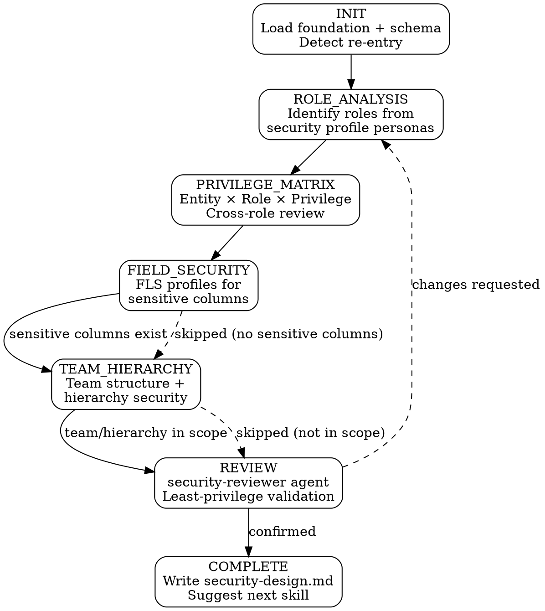

# Security Design

security walks through security design in layers: identify who needs access (roles), define what they can do (privileges), lock down sensitive data (field-level security), then handle organizational structure (teams and hierarchy). Each layer builds on the previous. The primary output is `docs/security-design.md`.

**Announce:** "I'm using the security skill to [create/resume/update] your security design."

## Plan Mode Exit

<HARD-GATE>
This skill writes files at REVIEW and COMPLETE stages. If plan mode is active, tell the developer:
"security needs to write files as we go. Please exit plan mode (Shift+Tab) so I can proceed."
Do NOT continue past Mode Selection while plan mode is active.
</HARD-GATE>

---

## Prerequisites

<HARD-GATE>
Before proceeding, verify all of the following exist in `.foundation/` and are NOT placeholders:
- `00-project-identity.md`
- `03-entity-map.md`

And verify the physical model exists:
- `docs/schema-physical-model.md`

If foundation files are missing → STOP:
"I need a project foundation before I can design security. Run solution-discovery first."

If the physical model is missing → STOP:
"I need the physical data model to build the privilege matrix. Run schema-design first."

Also verify `.foundation/.discovery-state.json` shows `"stage": "COMPLETE"`.
</HARD-GATE>

---

## Optional Input Detection

```
IF .foundation/08-security-profile.md exists AND is NOT placeholder:
  → Load for persona declarations and sensitivity flags
  → Announce: "Security profile loaded — [N] personas, [M] sensitive column flags."

IF .foundation/08-security-profile.md is absent or placeholder:
  → Warn: "No security profile found (or placeholder). All role and sensitivity
    decisions will require manual input. Consider running solution-discovery
    UPDATE mode to populate your security profile first."

IF docs/ddd-model.md exists:
  → Note bounded context assignments for role scoping
  → Announce: "DDD model loaded — bounded contexts available for role scoping."

IF docs/ui-design-spec.md exists:
  → Extract persona-to-app-type mapping
  → Announce: "UI design loaded — persona-to-entity visibility informs role design."

IF .foundation/05-ui-plan.md exists AND is NOT placeholder:
  → Cross-reference persona list
```

---

## Mode Selection

```
IF .pp-context/skill-state.json does not exist
   OR does not contain security entries → CREATE mode
IF skill-state.json shows activeSkill == "security"
   AND activeStage != "COMPLETE" → RESUME mode
IF skill-state.json shows "security" in completedSkills:
  → Check for existing docs/security-design.md
  → If exists, offer re-entry:
    - "Continue" — pick up where we left off
    - "Update" — revise existing design (add role, update privileges)
    - "Full re-run" — start fresh, diff against previous
  → If no artifact, treat as CREATE mode
```

## Companion File Loading

<EXTREMELY-IMPORTANT>
Load companion files at the specified points. These are directives, not suggestions.

**CREATE mode:**
1. Read `./conversation-guide.md` now.

**RESUME mode:**
1. Read `.pp-context/skill-state.json` to determine resume point.
2. Read `./conversation-guide.md` to continue from the first incomplete stage.

**Re-entry (Update or Full re-run):**
1. Read `./conversation-guide.md` now.
2. Read `docs/security-design.md` to present current state.
</EXTREMELY-IMPORTANT>

---

## CREATE Mode State Machine



## Stage-Gate Summary

| Stage | Writes | Can skip? | Gate condition |
|---|---|---|---|
| INIT | — | No | Foundation and physical model exist, mode selected |
| ROLE_ANALYSIS | — | No | Developer confirms role list with names, patterns, and persona mappings |
| PRIVILEGE_MATRIX | — | No | Developer confirms per-role matrix AND cross-role summary |
| FIELD_SECURITY | — | Yes — if no sensitive columns flagged | Developer confirms FLS profiles and role assignments |
| TEAM_HIERARCHY | — | Yes — if no team/hierarchy requirements | Developer confirms team structure and hierarchy model |
| REVIEW | — | No | security-reviewer agent dispatched, all HIGH findings resolved |
| COMPLETE | `docs/security-design.md`, `.pp-context/skill-state.json` | No | All artifacts written, next skill suggested |

---

## Red Flags

<HARD-GATE>
**Never do these:**

- Never propose Organization-level Write or Delete for a non-admin role without explicit justification
- Never skip PRIVILEGE_MATRIX — every entity must have a privilege assignment for every role
- Never skip the cross-role summary after individual role confirmation
- Never proceed past a stage gate without developer confirmation
- Never auto-start the next skill after COMPLETE — suggest, then wait
- Never modify foundation sections — flag gaps, suggest solution-discovery UPDATE
- Never use placeholder timestamps in state files or documents
- Never dismiss a HIGH finding from security-reviewer — it must be resolved
- Never apply FLS to primary name columns (breaks usability)
</HARD-GATE>

---

## Integration

- **Upstream:** schema-design (physical model — required), ui-design (persona-to-app mapping — recommended)
- **Downstream:**
  - alm-workflow — reads `docs/security-design.md` for security role XML generation and FLS profile packaging
  - environment-setup — reads `docs/security-design.md` for team creation, role assignment, and hierarchy configuration
- **Cross-reference:** If `08-security-profile.md` is incomplete, flag and suggest solution-discovery UPDATE mode
- **Agent:** security-reviewer (dispatched at REVIEW stage)
