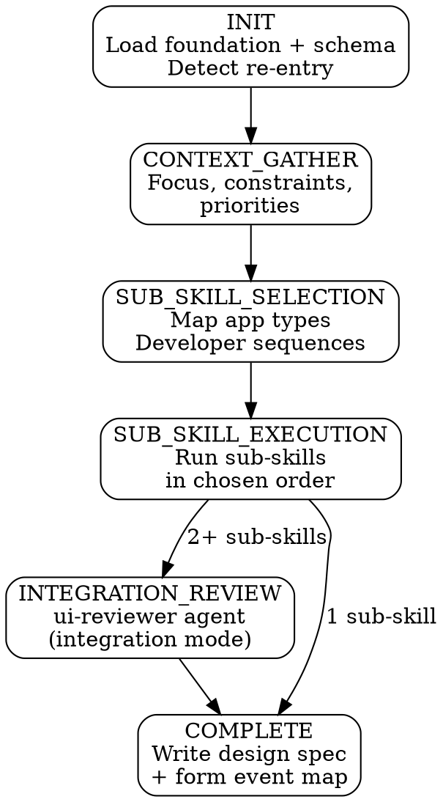

# UI Design

ui-design is a **router skill** that gathers context, presents available UI sub-skills matched to your project's app types, and dispatches to the correct sub-skill in developer-chosen sequence. Each sub-skill is fully self-contained — it runs its own complete state machine and returns control to the router on completion.

**Announce:** "I'm using the ui-design skill to [create/resume/add to] your UI design."

## Plan Mode Exit

<HARD-GATE>
This skill and its sub-skills write files at WIREFRAME, REVIEW, and COMPLETE stages. If plan mode is active, tell the developer:
"ui-design needs to write files as we go. Please exit plan mode (Shift+Tab) so I can proceed."
Do NOT continue past Mode Selection while plan mode is active.
</HARD-GATE>

---

## Prerequisites

<HARD-GATE>
Before proceeding, verify all of the following exist in `.foundation/` and are NOT placeholders:
- `00-project-identity.md`
- `02-architecture-decisions.md`

And verify the physical model exists:
- `docs/schema-physical-model.md`

If foundation files are missing → STOP:
"I need a project foundation before I can design your UI. Run solution-discovery first."

If the physical model is missing → STOP:
"I need the physical data model to design forms and screens. Run schema-design first."

Also verify `.foundation/.discovery-state.json` shows `"stage": "COMPLETE"`.
If discovery is not complete → STOP:
"solution-discovery is still in progress (stage: [stage]). Complete discovery first."
</HARD-GATE>

---

## Optional Input Detection

Check for these optional inputs and announce their status:

```
IF docs/ddd-model.md exists:
  → Load for aggregate-aware form grouping and tab structure
  → Announce: "DDD model loaded — aggregate boundaries will inform form tab groupings."

IF .foundation/05-ui-plan.md exists AND is NOT placeholder:
  → Load for persona-to-app-type mapping
  → Announce: "UI plan loaded — [N] personas mapped to app types."

IF .foundation/05-ui-plan.md is absent or placeholder:
  → Note: "No UI plan found. App type selection will rely on architecture decisions
    and developer input."
```

---

## Mode Selection

At INIT, determine the operating mode:

```
IF .pp-context/skill-state.json does not exist
   OR does not contain ui-design entries → CREATE mode
IF skill-state.json shows activeSkill == "ui-design"
   AND activeStage != "COMPLETE" → RESUME mode
IF skill-state.json shows "ui-design" in completedSkills:
  → Check for existing ui-design artifacts in docs/
  → If artifacts exist, offer re-entry:
    - "Continue" — pick up from where we left off
    - "Add sub-skill" — keep existing work, design an additional app type
    - "Revise" — revisit a completed sub-skill design
  → If no artifacts, treat as CREATE mode
```

## Companion File Loading

<EXTREMELY-IMPORTANT>
Load companion files at the specified points. These are directives, not suggestions.

**CREATE mode:**
1. Read `./conversation-guide.md` now.

**RESUME mode:**
1. Read `.pp-context/skill-state.json` to determine resume point.
2. Read `./conversation-guide.md` to continue from the first incomplete stage.
3. If resuming inside a sub-skill, also read that sub-skill's SKILL.md.

**Re-entry (Add sub-skill or Revise):**
1. Read `./conversation-guide.md` now.
2. Read existing design artifacts to present current state.
</EXTREMELY-IMPORTANT>

---

## Router State Machine



## Stage-Gate Summary

| Stage | Writes | Can skip? | Gate condition |
|---|---|---|---|
| INIT | — | No | Foundation and physical model exist, mode selected |
| CONTEXT_GATHER | — | No | Developer provides context or confirms foundation is current |
| SUB_SKILL_SELECTION | — | No | Developer selects sub-skills and confirms sequence |
| SUB_SKILL_EXECUTION | Sub-skill artifacts | No | Each sub-skill completes its own state machine |
| INTEGRATION_REVIEW | — | Yes — if only one sub-skill was run | ui-reviewer integration mode confirms cross-sub-skill consistency |
| COMPLETE | `docs/ui-design-spec.md`, `docs/ui-form-event-map.md`, `.pp-context/skill-state.json` | No | All artifacts written, next skill suggested |

## Sub-skill Dispatch Protocol

<EXTREMELY-IMPORTANT>
When dispatching a sub-skill:

1. Read the sub-skill's SKILL.md from the appropriate subdirectory (e.g., `./model-driven-app/SKILL.md`)
2. Follow the sub-skill's state machine completely — do NOT skip stages
3. When the sub-skill reaches COMPLETE, return to the router
4. Present the between-sub-skill prompt if more sub-skills are in the queue:
   "[Sub-skill name] design is complete. Next in your queue: **[next sub-skill]**. Ready to continue, or do you want to pause here?"
5. Update `.pp-context/skill-state.json` after each sub-skill completes
</EXTREMELY-IMPORTANT>

## Available Sub-skills

| Sub-skill | App type | Wireframe tool | Directory |
|---|---|---|---|
| model-driven-app | MDA forms, views, dashboards, charts, sitemap, command bar | Mermaid | `./model-driven-app/` |
| canvas-app | Canvas app screens, navigation, data sources, responsive layout | Canva | `./canvas-app/` |
| pcf-control | PCF component spec, manifest, React/TypeScript scaffold | Mermaid | `./pcf-control/` |
| custom-page | Hybrid MDA/Canvas embedded page | Canva | `./custom-page/` |
| modal-dialog | Lightweight dialog triggered from form or app | Canva | `./modal-dialog/` |
| code-app | Standalone React/Vite/TypeScript app on Power Platform | Canva | `./code-app/` |

---

## Red Flags

<HARD-GATE>
**Never do these:**

- Never skip CONTEXT_GATHER — even if the foundation seems comprehensive, the conversation captures current focus
- Never auto-dispatch sub-skills — the developer always selects and sequences
- Never skip a sub-skill's stages — each sub-skill's state machine is complete and mandatory
- Never auto-start the next skill after COMPLETE — suggest, then wait
- Never write `docs/ui-form-event-map.md` before all selected sub-skills have completed
- Never modify foundation sections — flag gaps, suggest solution-discovery UPDATE, but do not edit
- Never proceed past a stage gate without developer confirmation
- Never use placeholder timestamps in state files or documents
</HARD-GATE>

---

## Integration

- **Upstream:** schema-design (physical model — required), application-design (DDD model — recommended)
- **Downstream:**
  - business-logic — reads `docs/ui-form-event-map.md` for client script dispatch
  - alm-workflow — reads `docs/ui-design-spec.md` for app component packaging
- **Cross-reference:** If CONTEXT_GATHER reveals a UI requirement that contradicts the foundation's architecture decisions (e.g., foundation specifies MDA but requirement needs full-screen custom UI), flag the tension and suggest reviewing `02-architecture-decisions.md`
- **Agent:** ui-reviewer (dispatched at each sub-skill REVIEW stage and at INTEGRATION_REVIEW)
